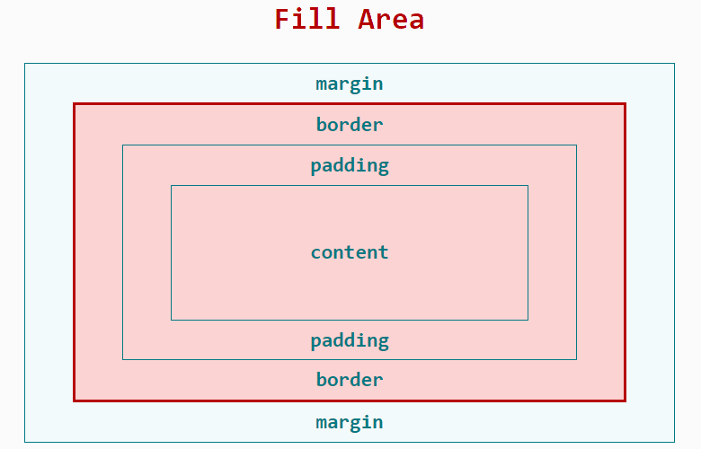

# CSS Superfriday!

---

## what about it?

- CSS fundamentals
- The problem with CSS
- Some solutions
- Let's practice!

---

## css fundamentals

---

## what is css?


---

## but really...
> used to style and layout web pages &mdash; for example, to alter the font, colour, size and spacing of your content, split it into multiple columns, or add animations and other decorative features <br /> &mdash; MDN web docs


notes:
show amazing things you can do with CSS
https://blog.codepen.io/2018/09/05/the-dogs-of-codepen/
https://colorlib.com/wp/css-layouts/

---

## anatomy of a css ruleset


notes:

** Show demo/1-css-fundamentals to change the colour of the paragraph

Selector

The HTML element name at the start of the rule set. It selects the element(s) to be styled (in this case, "p" elements). To style a different element, just change the selector.

Declaration

A single rule like color: red; specifying which of the element's properties you want to style.

Properties

Ways in which you can style a given HTML element. 

Property value

To the right of the property after the colon, we have the property value, which chooses one out of many possible appearances for a given property (there are many color values besides red).

-- MDN web docs

---

## cascade & specificity

selectors overrule each other in this order
1. importance
2. specificity
3. source order

---

## importance
using *`!important`* keyword will take the highest priority

```css
p {
    color: red !important;
}
```

---

## specificity
> a measure of how specific a selector is &mdash; how many elements it could match <br /> &mdash; MDN web docs

---

## selectors from the highest specificity to the lowest
1. inline styles
2. id selectors (e.g. #example).
3. class selectors (e.g. .example), attributes selectors (e.g. [type="radio"]) and pseudo-classes (e.g. :hover).
4. element selectors (e.g. h1) and pseudo-elements (e.g. ::before).

notes:

** use 2-specificity to demo each type of selector

demo what happens when you use the selector with !important

---

## source order

```css
p {
    color: red;
}

/* this overrides red */
p {
    color: blue;
}
```

---

## box model


---

the fill area gets filled by the background property




notes:

as you can see, this includes the content area, padding and border

