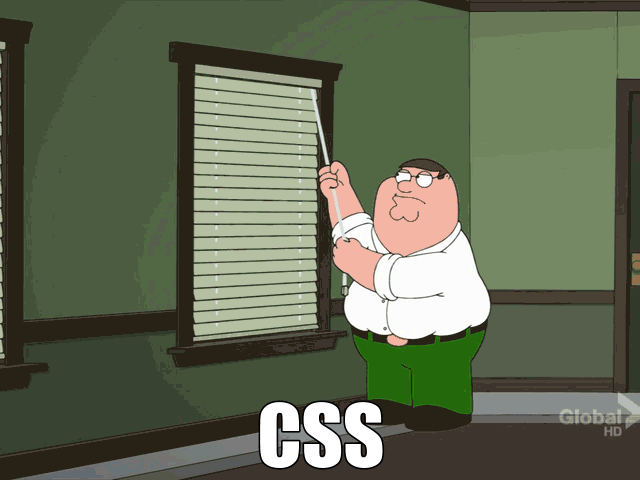

# CSS Superfriday!

---

## What about it?

- CSS fundamentals
- The problem with CSS
- Some solutions
- Let's practice!

---

## CSS fundamentals

---

## What is CSS?

---

## But really...
> used to style and layout web pages &mdash; for example, to alter the font, colour, size and spacing of your content, split it into multiple columns, or add animations and other decorative features - MDN web docs

notes:
show amazing things you can do with CSS
https://blog.codepen.io/2018/09/05/the-dogs-of-codepen/
https://colorlib.com/wp/css-layouts/

---

## Anatomy of a CSS ruleset

notes:

** Show demo/1-css-fundamentals to change the colour of the paragraph

Selector

The HTML element name at the start of the rule set. It selects the element(s) to be styled (in this case, "p" elements). To style a different element, just change the selector.

Declaration

A single rule like color: red; specifying which of the element's properties you want to style.

Properties

Ways in which you can style a given HTML element. 

Property value

To the right of the property after the colon, we have the property value, which chooses one out of many possible appearances for a given property (there are many color values besides red).

-- MDN web docs